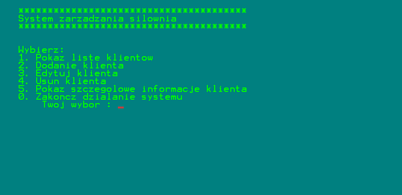

# Gym management system

This is an console appliaction of gym management system.

## Install and open
Clone the repository and open .sln file in Microsoft Visual Studio. Then run the application.

## Features and options

- displaying a list of all customers
- adding a new customer
- editing a customer
- deleting a customer 
- displaying detailed information about the customer

## Stack
C++

## Preview screenshot

